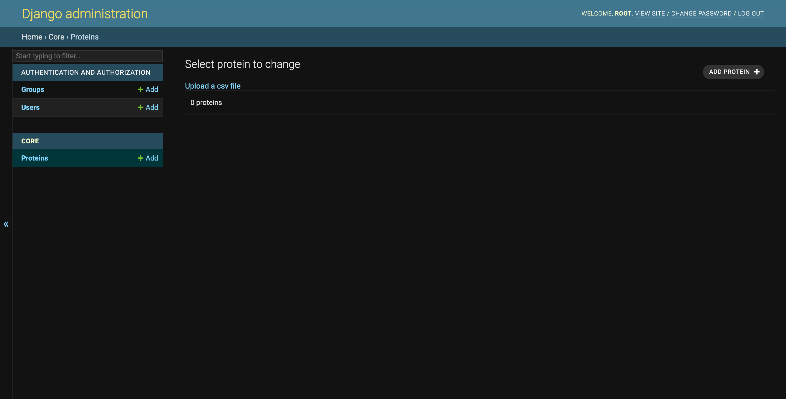

# BioinformaticianTechnicalAssignment

### Running The Application Locally

Change the directory to DB-Docker:

```
cd SQL-Docker
```

ّIn this folder, you will find a Dockerfile used for creating the mysql image. execute the file by running the command below and wait until the build is complete:

```
docker build --tag mysql_db .
```

Then move back to the main directory and run the command below to execute the Dockerfile which is used to build the application image:
```
docker build --tag bio-ta .
```

After building is finished, run the command below to run the application:

```
docker-compose up
```

### Migrations

Once application is running, open a new terminal window and run the command below to create the default Django ORM models:

```
docker exec -it django_container python manage.py makemigrations
docker exec -it django_container python manage.py migrate
```
Once the migrations are complete, close the terminal.

### Populating Data
There are two ways to populate data into the database:
##### 1) Using Notebook
Use the function provided in the Notebook.ipynb by running the cell in which the ```populateData()``` is called the csv file will be populated in the mysql db.

##### 1) Using Admin Profile
To use the django admin protal, you first need to create an admin user. To do so, make sure you have the application running (see [link](#1-Running-The-Application-Locally)). Then open a new terminal and eun the command below:
```
docker exec -it django_container python manage.py createsuperuser
```
Then follow the instruction to set the credentials. Next, go to the address below in your browser and login using the credentials provided.
```sh
127.0.0.1:8000/admin
```
A ```Upload a csv file``` link has been added to the Django admin portal through which you can choose and upload a .csv file to populate the data. 

### Running the Testcases
To run the testscases, run the command below:
```
docker exec -it django_container python manage.py test
```

